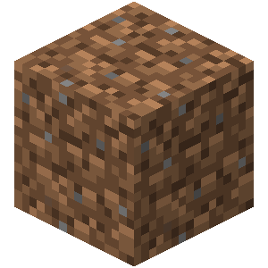
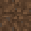
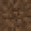
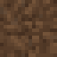

# texgen — генератор SVG-текстур из фото и рендеров кубов

Утилита родилась из усталости: текстуры для своего сайта я генерировал через ИИ,
а потом подолгу правил SVG попиксельно вручную. texgen буквально решение для меня —
картинка на входе, готовая пиксельная текстура на выходе.

Только стандартная библиотека Go — внешних зависимостей нет.

---

## Возможности

- **Любая картинка → SVG-текстура 16×16** (размер сетки настраивается): фото даунскейлится
  усреднением по площади, пиксель-арт — nearest-neighbor.
- **Автоматическая палитра**: для фото — квантование медиан-катом до N цветов; если в картинке
  уже ≤ N цветов (пиксель-арт) — цвета сохраняются как есть, конвертация побайтово точная.
- **Извлечение из изо-куба** (режим `cube`): автопоиск куба по силуэту, выбор грани
  (top / left / right), суперсэмплинг, срез антиалиасинга по контуру.
- **Автокомпенсация затенения граней** (рендеры затемняют бока) + ручная яркость `-bright`.
- **Прозрачность**: полностью прозрачные тексели не получают rect.
- **Пакетная обработка**: несколько файлов за один вызов.
- **Компактный вывод**: `<g fill>` на цвет, соседние пиксели строки слиты в `<rect width=N>`,
  комментарий с hex и числом пикселей.

## Сборка

```bash
go mod init texgen    # один раз, если ещё нет go.mod
go build -o texgen .  # бинарник texgen (.exe на Windows)

# либо без сборки:
go run . [flags] файлы...
```

> Запускать нужно весь пакет (`go run .` / `go build .`), а не `go run main.go`:
> проект состоит из двух файлов, `main.go` и `cube.go`, иначе будет `undefined: runCube`.

---

## Режим 1 — обычная конвертация картинки

```bash
texgen [flags] файл.[png|jpg|gif] [ещё файлы...]
```

| Флаг       | По умолчанию       | Значение                                                                                     |
| ---------- | ------------------ | -------------------------------------------------------------------------------------------- |
| `-w`       | `16`               | ширина сетки текстуры (в текселях)                                                           |
| `-h`       | `16`               | высота сетки                                                                                 |
| `-colors`  | `4`                | максимум цветов палитры. Для фото 4–8; если в исходнике цветов меньше — сохраняются как есть |
| `-px`      | `4`                | экранный размер одного текселя (width SVG = w·px)                                            |
| `-nearest` | `false`            | nearest-neighbor вместо усреднения по площади (для пиксель-арт источников)                   |
| `-bright`  | `1`                | яркость: `<1` темнее (`0.6` = −40%), `>1` светлее (мягко, без клипования светов)             |
| `-out`     | имя входа + `.svg` | файл вывода                                                                                  |

### Примеры

```bash
# фото камня -> текстура (4 цвета)
./texgen -colors 4 photo.jpg

# богаче фактура
./texgen -colors 6 stone_photo.png

# оригинальный пиксель-арт PNG из игры — побайтово, без квантования
./texgen -nearest -colors 64 stone.png

# другая сетка, например 32×32
./texgen -w 32 -h 32 -colors 8 big.jpg

# на 40% темнее (вариант «для пещер»)
./texgen -colors 5 -bright 0.6 stone_photo.jpg

# имитация шейдинга граней как в MC: две затемнённые копии базы
./texgen -bright 0.8 -out stone_side_l.svg stone_base.png
./texgen -bright 0.6 -out stone_side_r.svg stone_base.png
```

---

## Режим 2 — извлечение текстуры из рендера куба (`cube`)

Работает с рендерами в стиле Minecraft Wiki: изометрический куб на прозрачном
или однотонном фоне.

```bash
texgen cube [flags] render.[png|jpg|gif] [ещё файлы...]
```

| Флаг       | По умолчанию             | Значение                                                                           |
| ---------- | ------------------------ | ---------------------------------------------------------------------------------- |
| `-face`    | `right`                  | грань: `top` \| `left` \| `right`                                                  |
| `-size`    | `16`                     | размер сетки (квадратная)                                                          |
| `-colors`  | `4`                      | максимум цветов палитры                                                            |
| `-px`      | `4`                      | экранный размер текселя в SVG                                                      |
| `-ss`      | `4`                      | сэмплов на тексель (качество усреднения), разумно 2–8                              |
| `-inset`   | `0.04`                   | отступ от краёв грани (доля стороны) — срезает антиалиасинг контура                |
| `-unshade` | `true`                   | компенсировать затенение грани по самой светлой грани; выключить: `-unshade=false` |
| `-mirror`  | `false`                  | отзеркалить текстуру по горизонтали (если грань снялась «не в ту сторону»)         |
| `-bright`  | `1`                      | финальная яркость (семантика как в режиме 1)                                       |
| `-tol`     | `12`                     | допуск цвета фона для непрозрачных картинок (jpg, скриншоты)                       |
| `-out`     | имя входа + `_грань.svg` | файл вывода                                                                        |

Порядок обработки: поиск силуэта → снятие грани с усреднением → компенсация затенения
(`-unshade`) → зеркало (`-mirror`) → яркость (`-bright`) → палитра → SVG.

### Примеры

```bash
# правая грань куба
texgen cube -face right dirt_render.png

# левая / верхняя
texgen cube -face left dirt_render.png
texgen cube -face top dirt_render.png

# богаче палитра
texgen cube -face right -colors 6 dirt_render.png

# пачкой все рендеры сразу
texgen cube -face right a.png b.png c.png

# deepslate-версия той же земли
texgen cube -face right -bright 0.55 -out dirt_deep.svg Dirt_JE2_BE2.png

# чуть высветлить, если рендер вышел мутным
texgen cube -face top -bright 1.25 Dirt_JE2_BE2.png

# то же через go run
go run . cube -face right -bright 0.8 -out stone_side.svg dirt_render.png
```

### Живой пример: один рендер → три текстуры (папка `example/`)

В папке `example/` лежит исходный рендер и результаты съёма всех трёх граней:
`dirt.png` (источник), `dirt_top.svg`, `dirt_left.svg`, `dirt_right.svg`.

<table>
  <tr>
    <th align="center">Исходник<br><code>example/dirt.png</code></th>
    <th align="center">грань <code>top</code><br><code>dirt_top.svg</code></th>
    <th align="center">грань <code>left</code><br><code>dirt_left.svg</code></th>
    <th align="center">грань <code>right</code><br><code>dirt_right.svg</code></th>
  </tr>
  <tr>
    <td align="center"></td>
    <td align="center"></td>
    <td align="center"></td>
    <td align="center"></td>
  </tr>
</table>

Команды и вывод консоли (обрати внимание на коэффициенты `unshade`):

```console
$ go run . cube -face right -colors 10 -bright 0.7 dirt.png
dirt.png: грань=right сетка=16 цветов=10 unshade=x1.62 bright=0.70 -> dirt_right.svg

$ go run . cube -face left -colors 10 -bright 0.7 dirt.png
dirt.png: грань=left сетка=16 цветов=10 unshade=x1.23 bright=0.70 -> dirt_left.svg

$ go run . cube -face up -colors 10 -bright 0.7 dirt.png
неизвестная грань: up (нужно top|left|right)

$ go run . cube -face top -colors 10 -bright 0.7 dirt.png
dirt.png: грань=top сетка=16 цветов=10 unshade=x1.00 bright=0.70 -> dirt_top.svg
```

Как читать этот лог:

- `unshade=x1.00` у `top` — верхняя грань в рендере самая светлая, она эталон;
  `left` домножилась на 1.23, `right` на 1.62 — настолько рендер их затемнил.
  После компенсации все три текстуры выглядят одинаково по яркости, хотя сняты с разных граней.
- `bright=0.70` — поверх компенсации применено общее затемнение на 30% (художественный вариант).
- Строка с `-face up` — пример защиты от опечатки: допустимы только `top|left|right`.

> Если просмотрщик Markdown не рисует SVG (редкие IDE-превью), открой `example/*.svg`
> в браузере или смотри их же на GitHub/GitLab — там они рендерятся как обычные картинки.

---

## Формат вывода

```svg
<svg xmlns="http://www.w3.org/2000/svg" width="64" height="64" viewBox="0 0 16 16"
    shape-rendering="crispEdges">
    <!-- #7d7d7d : 170 px -->
    <g fill="#7d7d7d">
        <rect x="0" y="0" width="5" height="1" />
        ...
    </g>
    ...
</svg>
```

- группы идут по убыванию покрытия (самый частый цвет первый);
- в комментарии — hex цвета и число пикселей: удобно править палитру руками;
- прозрачные тексели не пишутся ничем;
- SVG → PNG конвертируется nearest-neighbor в 16×16 / 32×32 / 64×64 без артефактов.

## Подсказки и грабли

- **Подкоманда и её флаги — после слова `cube`**: правильно `texgen cube -face right ...`;
  `texgen -face right ...` — ошибка (флаг `-face` в первом режиме не существует).
- **Фон для cube**: прозрачный (PNG с вики) определяется по альфе; однотонный — по цвету угла
  с допуском `-tol`. Тени, водяные знаки и рамка вокруг куба ломают детект.
- **«силуэт не похож на изо-куб»** — картинка не стандартный изо-рендер (другой угол, тень,
  несколько блоков подряд).
- **`-unshade=false`** нужен блокам с реально разными гранями (трава, тыква), иначе яркость
  будет выровнена там, где не надо.
- **`-bright`** применяется до построения палитры, поэтому hex в комментариях SVG уже финальные.
  Разумный диапазон 0.3–2.0; `-bright 0` даст полностью чёрную текстуру.
- **Drag & drop**: положи рядом с `texgen.exe` файл `convert.bat` с содержимым
  `@texgen.exe -colors 6 %1` — перетаскивай картинку на батник, SVG ляжет рядом.
- **WebP** из коробки не читается: нужно добавить зависимость `golang.org/x/image/webp`
  и строку `import _ "golang.org/x/image/webp"`.

## Шпаргалка по флагам

- Режим 1: `-w -h -colors -px -nearest -bright -out`
- Режим 2 (`cube`): `-face -size -colors -px -ss -inset -unshade -mirror -bright -tol -out`